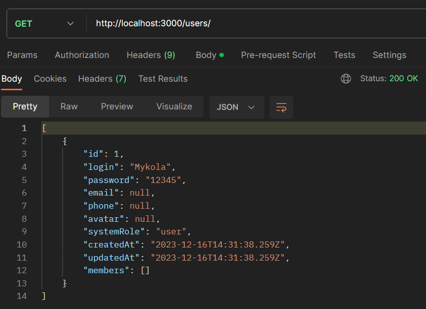
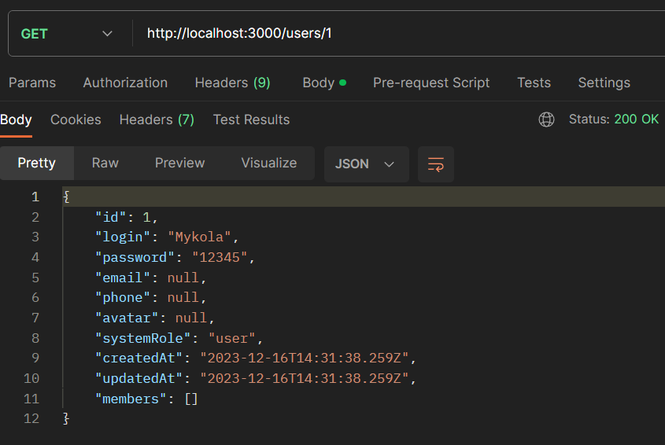
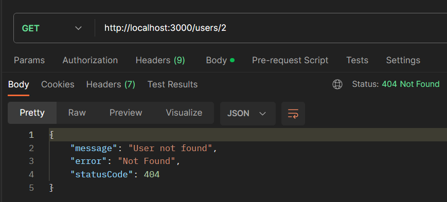
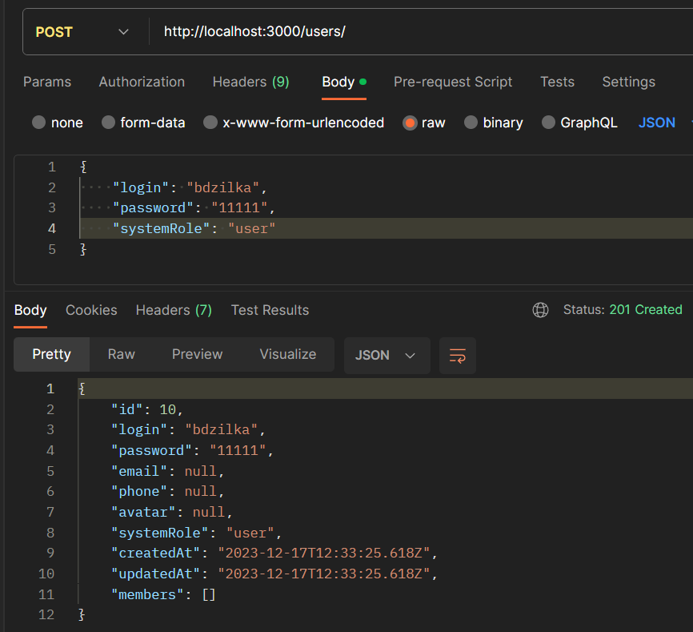
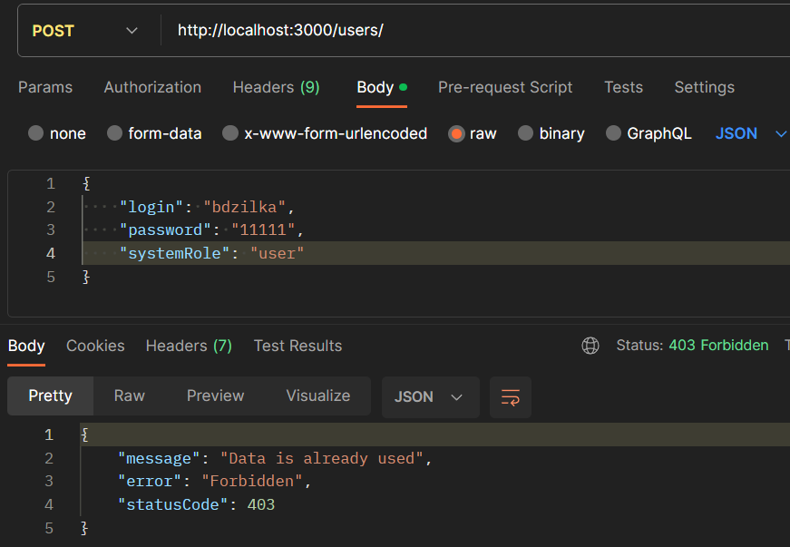
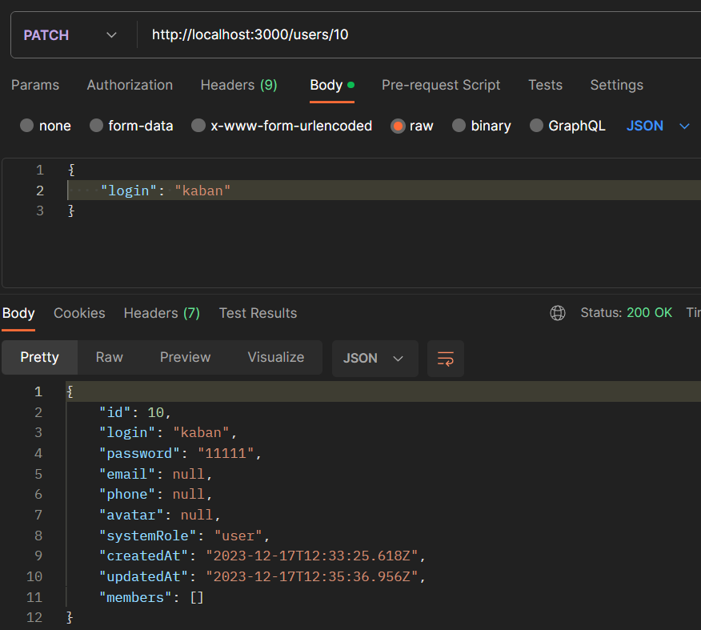
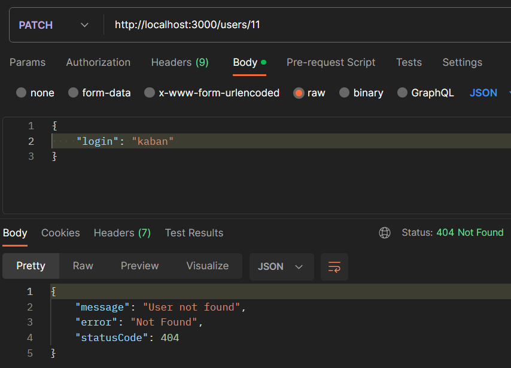
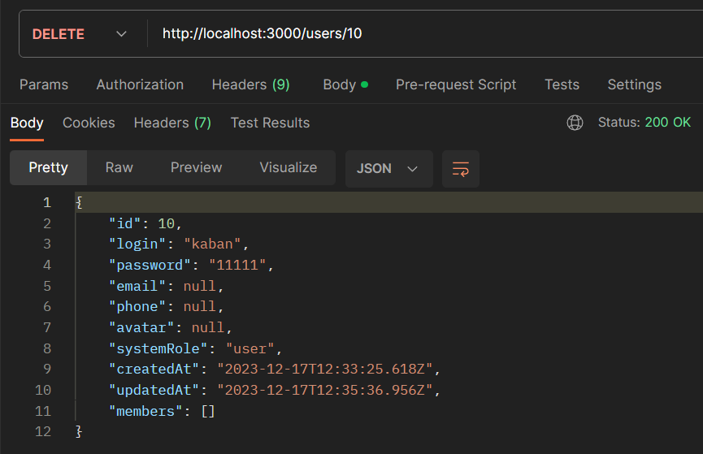
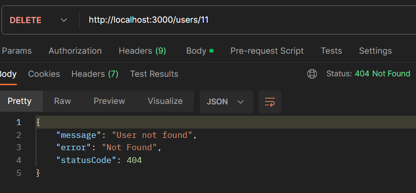

# Тестування працездатності системи

Тестування сервісу проводилося за допомогою застосунку [Postman](https://www.google.com/search?q=postman&rlz=1C1GCEA_enUA1034UA1034&oq=postman&gs_lcrp=EgZjaHJvbWUqCQgAEEUYOxiABDIJCAAQRRg7GIAEMgcIARAAGIAEMgcIAhAAGIAEMgcIAxAAGIAEMgcIBBAAGIAEMgcIBRAAGIAEMgcIBhAAGIAEMgcIBxAAGIAEMgcICBAAGIAEMgcICRAAGIAE0gEIMTA4NGowajeoAgCwAgA&sourceid=chrome&ie=UTF-8).

## Отримання користувача (метод GET)

### Успішне отримання усіх користувачів

### Успішне отримання одного користувача

### Спроба отримати неіснуючого користувача

## Створення користувача (метод POST)

### Успішне створення користувача

### Спроба створити користувача з вже існуючими даними

### Спроба створити користувача без відповідних даних

## Оновлення користувача (метод PATCH)

### Успішне оновлення користувача

### Оновлення неіснуючого користувача

## Видалення користувача (метод DELETE)

### Успішне видалення користувача

### Видалення неіснуючого користувача

